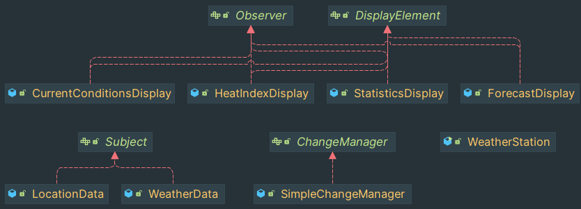

That's a simple implementation for Observer design-pattern.

- We have two `Subject` to observe, and they represent some weather data.
- `DisplayElement` is responsible for displaying some information based on 
the current weather data. This means `DisplayElement` should observe the `Subject`
and react to changes.
- `ChangeManager` provides and interface to attach and detach the `Observer` to the
provided `Subject`. It manages all the relationships in this small application.

Here is the class interaction diagram. Dependencies are omitted for readability 
