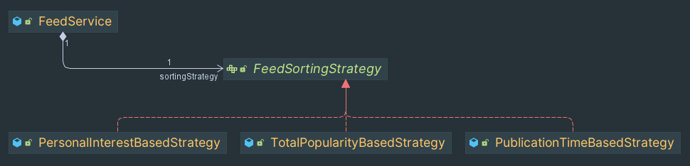

Typical entities model for representing social network was considered.

`FeedService`has a `FeedSortingStrategy` interface that declares 
an interface common to all supported algorithms for
sorting list of gathered possible candidates:
- `PersonalIntereatBasedStrategy` - sort by personal user interest
- `PublicationTimeBasedStrategy` -  sort by publication time 
- `TotalPopularityBasedStrategy` - sort by total interest 
in whole social network

Every implementation encapsulates sorting algorithm.

And of course using the interface in `FeedService` allows you to choose
implementation for sorting at runtime.

Here is the class interaction diagram 
