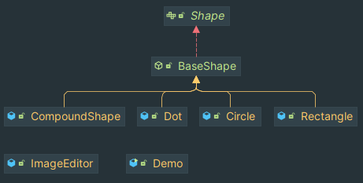

`BaseShape` is a base abstract component which is:

- defines the interface for objects in the composition
- implements default behavior

Here we have several "Leaf" components that define behavior for primitive objects in the composition.
They're: `Circle`, `Dot`, `Rectangle`.

`CompoundShape` is a composite which is:
- defines behavior for components that may have children
- stores child components
- implements child related operations

Here is the class interaction diagram 
