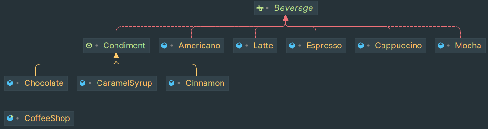

That's a simple implementation for Decorator design-pattern.

- We have several species of `Beverage`
- Every `Beverage` can be prepared with any number of `Condiment` which is a decorator for `Beverage`

Here is the class interaction diagram. Dependencies are omitted for readability 
